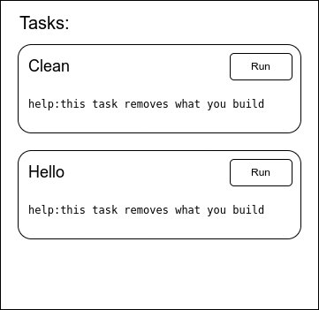
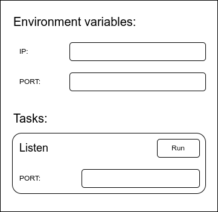

# bake-rs

> [!WARNING]  
> This project is not ready to use yet! it's just an idea.

Bake is a universal cross-platform script runner written in Rust which can be used for any kind of project or application.

Essentially, you put your tasks in a YAML file. Then, you have an interactive CLI + TUI + GUI interface to run these tasks, enabling your less tech-savvy coworkers (including yourself six months later, having forgotten all the commands) to execute your commands with the click of a button!

Bake can also help users install dependencies and set up environment variables. Furthermore, it supports a plugin system that allows you to import other people's bakefile.yaml configurations into your own.

## Table of content

- [Basic](#basic)
   * [CLI](#cli)
   * [TUI](#tui)
   * [GUI](#gui)
   * [Web](#web)
- [Error handling](#error-handling)
- [Build dependencies](#build-dependencies)
   * [Run other tasks from a task](#run-other-tasks-from-a-task)
- [Platform specific commands](#platform-specific-commands)
- [Environment variables](#environment-variables)
   * [global env](#global-env)
   * [param](#param)
   * [env validation](#env-validation)
   * [bake cache](#bake-cache)
- [Plugin system](#plugin-system)

## Basic

Make a file named 'bakefile.yaml' in root of your project

```yaml
tasks:
  - name: clean
    help_msg: this task removes what you build
    commands: [ rm ./build ]

  - name: hello
    help_msg: this task says hello
    commands: 
      - echo hello world
      - echo hello from bake
```

Now you have many ways to run your tasks:

### CLI

```sh
$ bake --show

[1] clean: this task removes what you build
[2] hello: this task says hello

$ 
```

```sh
$ bake clean

task clean -> 'rm ./build' is running
task clean -> 'rm ./build' is done

$ 
```

### TUI

```sh
$ bake

[1] clean: this task removes what you build
[2] hello: this task says hello

Enter task name or [index] to run: 2

task hello -> 'echo hello world' is running
hello world
task hello -> 'echo hello world' is done

task hello -> 'echo hello from bake' is running
hello from bake
task hello -> 'echo hello from bake' is done

[1] clean: this task removes what you build
[2] hello: this task says hello

Enter task name or [index] to run: 
```

### GUI

```sh
bake --gui
```



### Web

With web interface you can run commands remotely and see result.

You can start server by running:

```sh
bake --start-server --port 3000 --set-password PASS
```

hint: with web interface you can run some commands on your remote server by clicking a button!

you can set it up on your raspberry pi and use it as a web controller for your project.

Warning: if you are using it over internet make sure its behind an encryption layer (don't leak your password)

## Error handling

```yaml
tasks:
  - name: hello
    commands: 
      - echo 1
      - echo2 # this is an error
      - echo 3
```

```sh
task hello -> 'echo 1' is running
1
task hello -> 'echo 1' is done

task hello -> 'echo2' is running
Command 'echo2' not found
task hello -> 'echo2' failed

bake aborting hello
```

Note: task 'echo 3' will not run.

## Build dependencies

TODO: how to check version?

Sometimes you need some stuff installed on system to run a command.

for example to run your build task you need to have 'rust' installed.

check this out:

```yaml
dependencies:
  - name: rust
    check: [ cargo --version ]
    link: https://www.rust-lang.org/tools/install # install button opens browser and user should manually install it

  - name: clippy
    dependencies: [ rust ] # dependencies can depend on other dependencies
    check: [ cargo clippy --version ]
    command: [ cargo install clippy ] # install button will automatically install

  - name: check-file-exist-dependency
    check: [ ls target ] # you can check if a file or directory exist like this
    command: [ cargo build ]
```

Now you tasks can depends on dependencies

```yaml
tasks:
  - name: release
    dependencies: [ rust ] 
    commands: 
        - cargo build --release

  - name: check
    dependencies: [ rust, clippy ]
    commands:
      - cargo check
      - cargo clippy
      - cargo fmt --check
      - cargo test
```


Note: 'check' command works with [exit code](https://en.wikipedia.org/wiki/Exit_status#:~:text=In%20computing%2C%20the%20exit%20status,referred%20to%20as%20an%20errorlevel.)
so if the exit code is 0 this means dependency is installed or exist but any other non-zero code will try to run your specified command or link to get your dependency installed.

You can also specify different commands or links for installing on different platforms:

```yaml
dependencies:
  - name: wget
    check: [ wget --version ]
    commands_linux: [ sudo apt install wget ] # linux only
    link: https://www.gnu.org/software/wget/ # mac and windows
```

### Run other tasks from a task

For running other task from your task you need to put a '@' at the beginning of your command (so the parser will know it's a bake command and not a system binary)

```yaml
tasks:
  - name: release
    dependencies: [ rust ]
    commands: 
      - "@this.check" # run other tasks (before or after your commands)
      - cargo build --release

  - name: check
    cmd:
      - cargo check
```

## Platform specific commands

Sometimes you need to run different commands on different operating systems:

```yaml
tasks:
  - name: clean
    commands: # default  
        - rm ./target
    commands_windows: 
        - del target
```

Note: If you run this on a windows system only the windows commands will run but as you did not specify commands_linux and commands_macos if you run this task on Linux or MacOS it will run default commands.

## Environment variables

Sometimes your tasks need some environment variables to run in this case you can specify some 'envs' in your bakefile and bake will check if that environment variable is exist or not.

Note: you can provide a default EV for your requested EV by providing 'default' field in your yaml

```yaml
tasks:
  - name: listen
    envs:
      - name: PORT 
        default: 80
    cmd: [ nc -l -p $PORT ]
```



You can also specify simple validation for your env that checks value before run

1. number (float or integer)
1. integer
1. bool
1. !variants [ variation1, variation2, variation3, ...]

```yaml
tasks:
  - name: task_with_envs
    envs:
      - name: PORT
        default: 5
        validator: integer

      - name: build-mode
        default: debug
        validator: !variants [ debug, release ]
```

TODO: write doc about how to pass param to other tasks.

### bake cache

bake can save your env setups on a file 'bake.cache' make sure you add this file to gitignore to prevent leaking your API_KEYS

## Plugin system

You can import other peoples '.yaml' files and call there tasks from your tasks or depend on their dependencies.

```yaml
plugins:
  - name: fs
    path: ./.bake/fs.yaml
```

You can install/update plugins from internet by running:

```sh
bake --install http://github.com/path_to_plugin.yaml
```

Note: you can also write your local plugins for your project.
