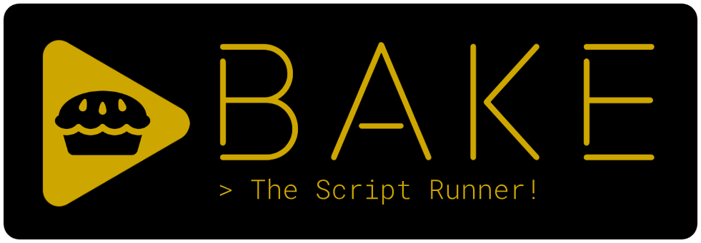

# Bake-rs

 

[](https://www.linux.org/ "Go to Linux homepage")
[](https://www.apple.com/macos/ "Go to Apple homepage")
[](https://www.microsoft.com/ "Go to Microsoft homepage")


[](https://github.com/ali77gh/bake-rs/blob/master/LICENSE)

Bake is a universal cross-platform script runner written in Rust which can be used for any kind of project or application.

Essentially, you put your tasks in a YAML file. Then, you have an interactive CLI + TUI + GUI interface to run these tasks, enabling your coworkers (and yourself six months later, having forgotten all the commands) to execute your commands with the click of a button!

Bake can also help users install dependencies and setup environment variables. Furthermore, it supports a plugin system that allows you to import other people's bakefile.yaml configurations into your own.

You can see roadmap [here](https://github.com/users/ali77gh/projects/5/)

## Table of content

- [Bake-rs](#bake-rs)
  - [Table of content](#table-of-content)
  - [Basic](#basic)
    - [Usage](#usage)
  - [Dependencies](#dependencies)
    - [Run other tasks from a task](#run-other-tasks-from-a-task)
  - [Platform specific commands](#platform-specific-commands)
  - [Environment variables](#environment-variables)
  - [Plugin system](#plugin-system)
  - [Stars](#stars)


## Basic

Make a file named 'bakefile.yaml'

```yaml
tasks:
  - name: clean
    help_msg: this task removes what you build
    commands: [ rm ./build ]

  - name: hello
    help_msg: this task says hello
    commands: 
      - echo hello world
      - echo hello from Bake
```

### Usage

```sh
$ bake --show
 Tasks: 

 ⚙  1  clean (this task removes what you build)

 ⚙  2  hello (this task says hello)
```

```sh
$ bake hello
  🛈 Verbose : task 'hello' is running...
hello world
hello from bake
  🛈 Verbose : Task 'hello' finished successfully. time: 2ms
```

Note: you will see same result by running 'bake 1'

## Dependencies

Sometimes you need some stuff installed on system to run a command.

for example to compile a Rust code-base you need to have 'cargo' installed.

```yaml
dependencies:
  - name: cargo
    check: [ cargo --version ]
    link: https://www.rust-lang.org/tools/install # install button opens browser and user should manually install it

  - name: clippy
    dependencies: [ cargo ] # dependencies can depend on other dependencies
    check: [ cargo clippy --version ]
    commands: [ cargo install clippy ] # install button will automatically install

  - name: check-file-exist-dependency
    check: [ ls target ] # you can check if a file or directory exist like this
    commands: [ cargo build ]
```

Now you tasks can depends on dependencies

```yaml
tasks:
  - name: release
    dependencies: [ cargo ] 
    commands: 
        - cargo build --release

  - name: check
    dependencies: [ cargo, clippy ]
    commands:
      - cargo check
      - cargo clippy
      - cargo fmt --check
      - cargo test
```

Note: by running 'release' Bake first gonna check if you have rust installed by running specified command: "cargo --version", if this commands exit with non zero code (means cargo is not installed) Bake will run cargo installation commands that you provided (or open provided link in browser) and while cargo is installed Bake will run 'release' task commands one by one.

Note: 'check' command works with [exit code](https://en.wikipedia.org/wiki/Exit_status#:~:text=In%20computing%2C%20the%20exit%20status,referred%20to%20as%20an%20errorlevel.)
so if the exit code is 0 this means dependency is installed or exist but any other non-zero code will try to run your specified command or link to get your dependency installed.

You can also specify different commands or links for installing on different platforms:


Note: by default bake will ask yes/no question before start installing, 
but by passing '--non--interactive' switch bake will not wait for stdin and will start installing dependency. 

```yaml
dependencies:
  - name: wget
    check: [ wget --version ]
    commands_linux: [ sudo apt install wget ] # linux only
    link: https://www.gnu.org/software/wget/ # mac and windows (in this case)
```

### Run other tasks from a task

For running other task from your task you need to put a '@' at the beginning of your command (so the parser will know it's a Bake command and not a system binary)

```yaml
tasks:
  - name: release
    dependencies: [ rust ]
    commands: 
      - "@this.check" # here
      - cargo build --release
      - "@this.publish" # here

  - name: check
    commands:
      - cargo check
      - cargo clippy
      - cargo fmt --check
      - cargo test

  - name: publish
    commands:
      - cargo publish
```

## Platform specific commands

Sometimes you need to run different commands on different operating systems:

```yaml
tasks:
  - name: clean
    commands: # default (linux and mac in this case)
        - rm ./target
    commands_windows: 
        - del target
```

Note: If you run this on a windows system only the windows commands will run but as you did not specify commands_linux and commands_macos if you run this task on Linux or MacOS it will run default commands.

Note: if you don't specify platform specific commands for a platform with no default commands Bake will show an error while running that task on that specific platform.

## Environment variables

Sometimes your tasks need some environment variables to run, in this case you can specify some 'envs' for your task and Bake will check if that environment variable is exist or not.

Note: you can also provide a default value for your env by providing 'default' field in your yaml

```yaml
tasks:
  - name: listen
    envs:
      - name: PORT 
        default: 80
    commands: [ nc -l -p $PORT ]
```

You can also specify simple validation for your env that checks value before run.

1. number (float or integer)
1. integer
1. bool
1. !variants [ variation1, variation2, variation3, ...]

```yaml
tasks:
  - name: task_with_envs
    envs:
      - name: PORT
        default: 5
        validator: integer

      - name: build-mode
        default: debug
        validator: !variants [ debug, release ]
```

And you can pass env to a task while calling it from another task

syntax is like:

```yaml
tasks:
  - name: task_with_envs_caller
    commands:
      - "@this.task_with_envs --PORT 80 --build-mode release" # passing params to other task
```

Note: by default bake will ask for env on cli if it's not set, 
but by passing '--non--interactive' switch bake will not wait for stdin and will raise an error. 

## Plugin system

You can import other peoples '.yaml' files and call there tasks from your tasks or depend on their dependencies.

```yaml
plugins:
  - name: fs
    path: ./.bake/fs.yaml
```

```yaml
tasks:
  - name: my_task
    commands:
      - "@fs.copy_file"
```

Note: you can also write your local plugins for your project.

## Stars
[](https://starchart.cc/ali77gh/bake-rs)